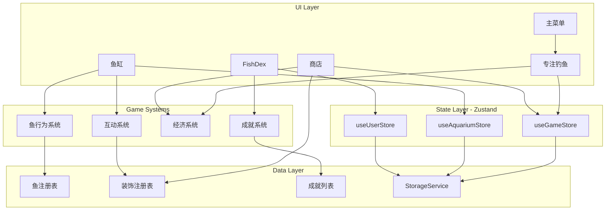
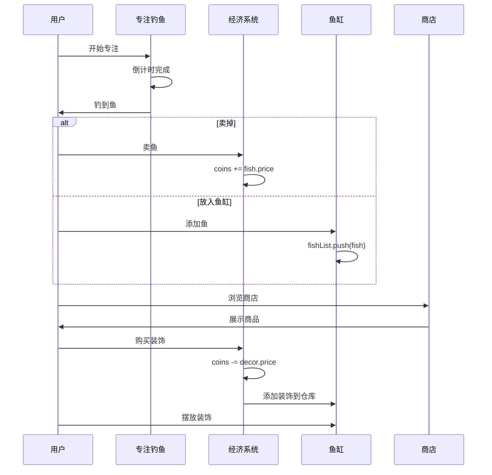

# Bottled Ocean v2 - 设计总览

> 文档版本: v1.0  
> 创建日期: 2024-12-15  
> 状态: 📋 Planning

---

## 设计目标

### 核心目标

| 目标 | 描述 | 验收标准 |
|------|------|---------|
| G1 | 完整的经济循环 | 用户可以钓鱼→卖鱼→赚金币→购买装饰→装饰鱼缸 |
| G2 | 可自定义的鱼缸 | 用户可以自由摆放/移动/删除装饰物 |
| G3 | 鱼与装饰互动 | 鱼会主动靠近装饰物并产生互动行为 |
| G4 | 专注数据可视化 | 用户可以查看日/周/月/年的专注统计图表 |
| G5 | 成就系统 | 用户可以解锁成就并查看进度 |
| G6 | 美术资源化 | 所有鱼和装饰使用图片资源而非程序生成 |

### 非目标（本次不做）

- 云端同步
- 多鱼缸场景
- 社交功能
- 鱼的饥饿/心情系统

---

## 架构图



---

## 功能模块索引

| 模块 | 文档 | 职责 | 依赖 |
|------|------|------|------|
| 🐟 鱼 | [[01-fish]] | 鱼的定义、渲染、行为 | 无 |
| 🏠 鱼缸 | [[02-aquarium]] | 鱼缸场景、渲染引擎 | 鱼、装饰物 |
| 🪴 装饰物 | [[03-decoration]] | 装饰定义、锚点、图层 | 无 |
| 🏪 商店 | [[04-shop]] | 商品列表、购买逻辑 | 装饰物、经济 |
| 📊 FishDex | [[05-fishdex]] | 统计、图鉴、成就 | 用户数据 |
| 💾 用户数据 | [[06-user-data]] | 存储、迁移、统计 | 无 |

---

## 数据流向



---

## 核心游戏循环

```
┌──────────────────────────────────────────────────────────┐
│                                                          │
│    钓鱼 ──→ 获得鱼 ──┬──→ 卖掉 ──→ 获得金币 ──┐         │
│     ↑               │                         │         │
│     │               └──→ 放入鱼缸             │         │
│     │                       ↓                 │         │
│     │              鱼缸越来越热闹              │         │
│     │                       ↓                 │         │
│     │              想要更多装饰 ←──────────────┘         │
│     │                       ↓                           │
│     └──────────── 继续钓鱼赚钱                           │
│                                                          │
└──────────────────────────────────────────────────────────┘
```

---

## 目录结构（重构后）

```
src/
├── App.tsx                    # 路由 + 全局 Provider
│
├── types/                     # 类型定义
│   ├── index.ts
│   ├── fish.ts
│   ├── decoration.ts
│   ├── user.ts
│   └── shop.ts
│
├── store/                     # 状态管理 (Zustand)
│   ├── useGameStore.ts
│   ├── useAquariumStore.ts
│   └── useUserStore.ts
│
├── data/                      # 静态数据注册表
│   ├── fishRegistry.ts
│   ├── decorRegistry.ts
│   ├── shopItems.ts
│   └── achievements.ts
│
├── systems/                   # 游戏系统
│   ├── FishBehavior.ts
│   ├── InteractionSystem.ts
│   ├── EconomySystem.ts
│   └── AchievementSystem.ts
│
├── components/
│   ├── canvas/
│   │   ├── AquariumCanvas.tsx
│   │   └── SimulationCanvas.tsx
│   └── ui/
│       ├── Shop/
│       ├── FishDex/
│       └── common/
│
├── services/
│   ├── StorageService.ts
│   ├── geminiService.ts
│   └── weatherService.ts
│
├── hooks/
│   ├── useDeviceOrientation.ts
│   ├── useFocusSession.ts
│   └── useFocusStats.ts
│
└── assets/
    └── sprites/
        ├── fish/
        └── decor/
```

---

## 相关文档

- [[01-fish]] - 鱼模块设计
- [[02-aquarium]] - 鱼缸模块设计
- [[03-decoration]] - 装饰物模块设计
- [[04-shop]] - 商店模块设计
- [[05-fishdex]] - FishDex 模块设计
- [[06-user-data]] - 用户数据模块设计
- [[99-implementation]] - 实施计划

---

#v2 #overview #architecture

