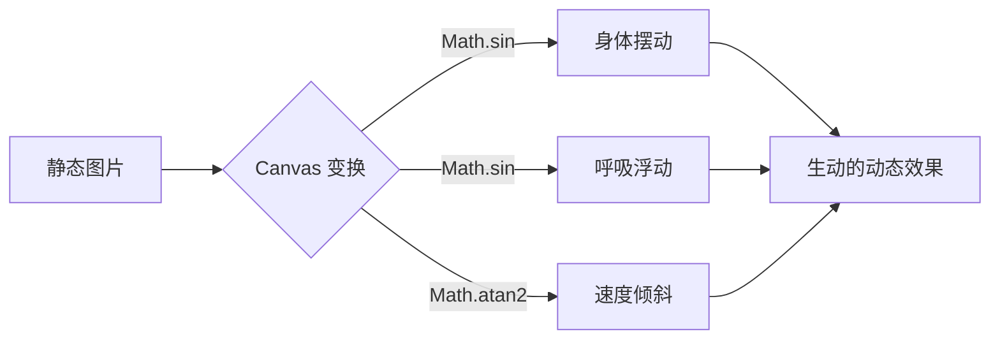
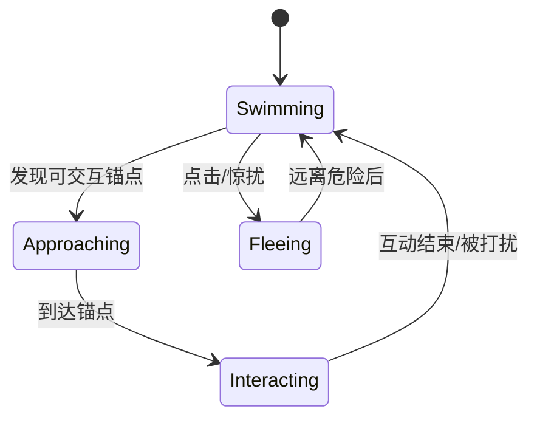
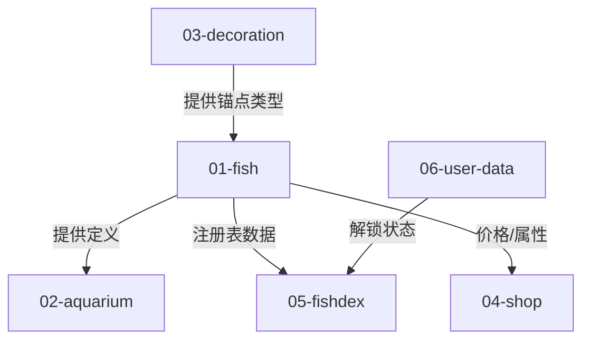

# 🐟 鱼模块设计

> 所属: Bottled Ocean v2  
> 状态: 📋 Planning (Refined for Procedural Animation)

---

## 模块职责

- 定义鱼的静态属性（外观、稀有度、价格、程序化动画参数）
- 管理鱼的运行时状态（位置、速度、行为状态）
- 通过 Canvas 变换实现程序化动画（Wiggle, Bob, Tilt）
- 实现鱼的 AI 行为（游动、互动、锚点寻找）

---

## 对外接口

### 提供给其他模块

| 接口 | 类型 | 使用方 | 说明 |
|------|------|--------|------|
| `FishDef` | Type | 鱼缸、商店、图鉴 | 鱼的静态定义 |
| `AquariumFish` | Type | 鱼缸 | 鱼的运行时实例 |
| `FISH_REGISTRY` | Data | 全局 | 所有鱼的注册表 (Source of Truth) |
| `getFishById()` | Function | 全局 | 根据 ID 获取鱼定义 |
| `createFishInstance()` | Function | 鱼缸 | 创建鱼实例 |

### 依赖其他模块

| 依赖 | 来源模块 | 说明 |
|------|----------|------|
| `AnchorType` | [[03-decoration]] | 用于互动系统判断鱼可以停留在哪些装饰物上 |
| `WeatherType` | 全局类型 | 钓鱼条件判断 |

---

## 数据结构

### FishDef - 鱼的静态定义

```typescript
interface FishDef {
  // === 基础信息 ===
  id: string;                      // 唯一标识: 'clownfish'
  name: string;                    // 显示名称: 'Nemo-ish'
  rarity: 'Common' | 'Rare' | 'Legendary';
  description: string;             // 简介
  
  // === 美术资源 (单帧 PNG) ===
  spriteUrl: string;               // 资源路径: '/assets/fish/clownfish.png'
  width: number;                   // 渲染宽度 px
  height: number;                  // 渲染高度 px
  
  // === 程序化动画参数 (调节手感) ===
  animation: {
    wiggleSpeed: number;           // 身体摆动频率 (推荐 2.0 - 5.0)
    wiggleAmount: number;          // 身体摆动幅度 (推荐 0.02 - 0.1)
    bobSpeed: number;              // 上下浮动频率 (推荐 1.0 - 3.0)
    bobAmount: number;             // 上下浮动像素 (推荐 2 - 5)
    tiltFactor: number;            // 转向时的倾斜系数 (0.0 - 1.0)
  };
  
  // === 钓鱼条件 ===
  minDurationMinutes: number;      // 最低专注时长
  weatherRequirement?: WeatherType[];  // 天气要求
  
  // === 经济 ===
  price: number;                   // 卖出价格
  
  // === 行为 ===
  swimSpeed: number;               // 游动速度 0.5-2.0
  preferredAnchors?: AnchorType[]; // 偏好的锚点类型 (如 'hide', 'rest')
}
```

### AquariumFish - 鱼的运行时实例

```typescript
interface AquariumFish {
  instanceId: string;              // 唯一实例 ID (UUID)
  fishId: string;                  // 对应 FishDef.id
  
  // 位置与物理状态
  x: number;
  y: number;
  targetX: number;
  targetY: number;
  speed: number;                   // 当前实时速度
  flipX: boolean;                  // 水平翻转 (true 为面向右)
  
  // 行为状态
  state: FishState;
  currentAnchorId?: string;        // 当前占用的装饰物锚点 ID
  stateStartTime: number;          // 进入当前状态的时间戳
}

type FishState = 'swimming' | 'approaching' | 'interacting' | 'fleeing';
```

---

## 程序化动画原理

不再依赖序列帧，而是通过 Canvas 的 `ctx` 变换模拟生命感：

1.  **身体摆动 (Wiggle)**: `ctx.scale(1 + sin(t), 1 - sin(t)*0.5)` 模拟尾巴推进。
2.  **呼吸浮动 (Bob)**: `ctx.translate(0, sin(t)*amount)` 模拟浮力。
3.  **速度倾斜 (Tilt)**: 鱼上浮或下潜时，根据 `dy/dx` 计算旋转角度。



---

## 行为系统

### 状态机



---

## 模块关联 (Obsidian)



---

## 相关文档

- [[00-overview]] - 返回总览
- [[02-aquarium]] - 鱼缸模块（处理鱼的物理模拟与渲染循环）
- [[03-decoration]] - 装饰物模块（定义鱼可以互动的锚点位置）
- [[04-shop]] - 商店模块（出售钓到的鱼）
- [[05-fishdex]] - 图鉴模块（展示已发现的鱼类详情）
- [[06-user-data]] - 用户数据（保存用户拥有的鱼及其收集进度）

---

#v2 #fish #procedural-animation #module
