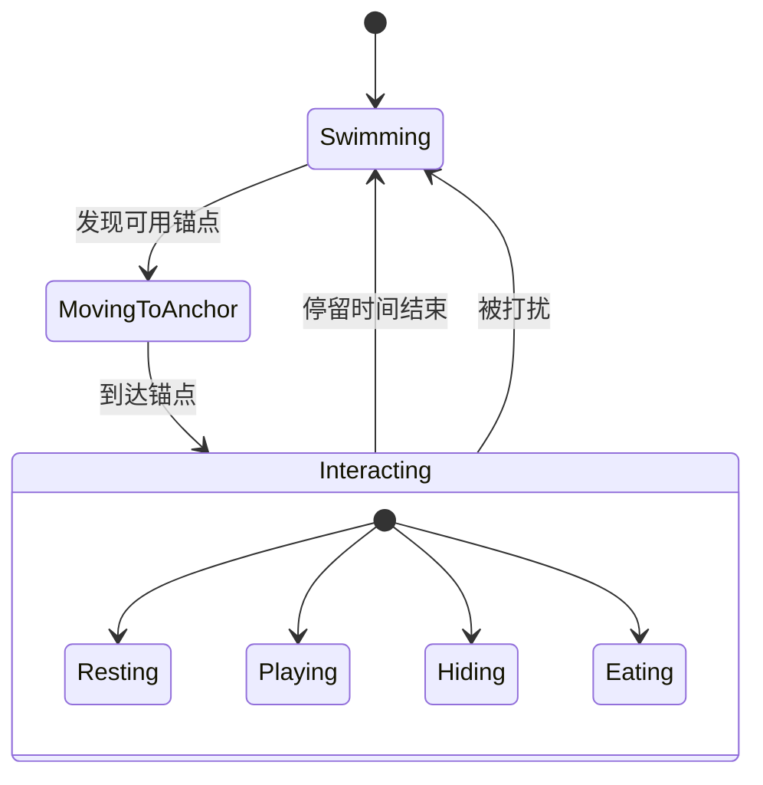

# 🐟 鱼模块设计

> 所属: Bottled Ocean v2  
> 状态: 📋 Planning

---

## 模块职责

- 定义鱼的静态属性（外观、稀有度、价格）
- 管理鱼的运行时状态（位置、速度、行为）
- 渲染鱼的精灵动画
- 实现鱼的 AI 行为（游动、互动）

---

## 对外接口

### 提供给其他模块

| 接口 | 类型 | 使用方 | 说明 |
|------|------|--------|------|
| `FishDef` | Type | 鱼缸、商店 | 鱼的静态定义 |
| `AquariumFish` | Type | 鱼缸 | 鱼的运行时实例 |
| `FISH_REGISTRY` | Data | 全局 | 所有鱼的注册表 |
| `getFishById()` | Function | 全局 | 根据 ID 获取鱼定义 |
| `createFishInstance()` | Function | 鱼缸 | 创建鱼实例 |

### 依赖其他模块

| 依赖 | 来源模块 | 说明 |
|------|----------|------|
| `Anchor` | 装饰物模块 | 用于互动系统判断 |
| `WeatherType` | 全局类型 | 钓鱼条件判断 |

---

## 数据结构

### FishDef - 鱼的静态定义

```typescript
interface FishDef {
  // 基础信息
  id: string;                      // 唯一标识: 'clownfish'
  name: string;                    // 显示名称: 'Nemo-ish'
  rarity: 'Common' | 'Rare' | 'Legendary';
  description: string;             // 简介
  
  // 美术资源
  spriteSheet: string;             // 精灵表路径
  frameCount: number;              // 动画帧数 (1-8)
  frameWidth: number;              // 单帧宽度 px
  frameHeight: number;             // 单帧高度 px
  
  // 钓鱼条件
  minDurationMinutes: number;      // 最低专注时长
  weatherRequirement?: WeatherType[];  // 天气要求（可选）
  
  // 经济
  price: number;                   // 卖出价格
  
  // 行为
  swimSpeed: number;               // 游动速度 0.5-2.0
  preferredAnchors?: AnchorType[]; // 偏好的锚点类型
}
```

### AquariumFish - 鱼的运行时实例

```typescript
interface AquariumFish {
  // 身份
  instanceId: string;              // 唯一实例 ID
  fishId: string;                  // 对应 FishDef.id
  
  // 位置状态
  x: number;
  y: number;
  targetX: number;
  targetY: number;
  angle: number;                   // 朝向角度
  speed: number;                   // 当前速度
  flipX: boolean;                  // 水平翻转
  
  // 行为状态
  state: FishState;
  currentAnchorId?: string;        // 当前占用的锚点
  stateStartTime: number;          // 状态开始时间
  
  // 动画状态
  currentFrame: number;
  animationTimer: number;
}

type FishState = 'swimming' | 'resting' | 'playing' | 'hiding' | 'eating';
```

---

## 行为系统

### 状态机



### 行为逻辑

```typescript
// systems/FishBehavior.ts

class FishBehavior {
  update(fish: AquariumFish, deltaTime: number, context: BehaviorContext) {
    switch (fish.state) {
      case 'swimming':
        this.updateSwimming(fish, deltaTime, context);
        break;
      case 'resting':
      case 'playing':
      case 'hiding':
      case 'eating':
        this.updateInteracting(fish, deltaTime);
        break;
    }
    
    this.updateAnimation(fish, deltaTime);
  }
  
  private updateSwimming(fish: AquariumFish, dt: number, ctx: BehaviorContext) {
    // 1. 检查是否到达目标
    const dist = Math.hypot(fish.x - fish.targetX, fish.y - fish.targetY);
    if (dist < 50) {
      // 设置新的随机目标
      fish.targetX = Math.random() * ctx.canvasWidth;
      fish.targetY = Math.random() * (ctx.canvasHeight - 200);
    }
    
    // 2. 向目标移动
    const angle = Math.atan2(fish.targetY - fish.y, fish.targetX - fish.x);
    fish.x += Math.cos(angle) * fish.speed * dt;
    fish.y += Math.sin(angle) * fish.speed * dt;
    
    // 3. 更新朝向
    fish.flipX = (fish.targetX - fish.x) > 0;
  }
}
```

---

## 渲染

### 精灵表格式

```
┌────────┬────────┬────────┬────────┐
│ Frame1 │ Frame2 │ Frame3 │ Frame4 │
└────────┴────────┴────────┴────────┘
每帧: frameWidth x frameHeight
总尺寸: (frameWidth * frameCount) x frameHeight
```

### 渲染代码

```typescript
function drawFish(ctx: CanvasRenderingContext2D, fish: AquariumFish) {
  const def = getFishById(fish.fishId);
  const img = loadedImages[def.spriteSheet];
  if (!img) return;
  
  ctx.save();
  ctx.translate(fish.x, fish.y);
  
  // 水平翻转
  if (!fish.flipX) {
    ctx.scale(-1, 1);
  }
  
  // 轻微上下浮动
  const bob = Math.sin(Date.now() * 0.003 + fish.instanceId.charCodeAt(0)) * 3;
  
  // 从精灵表裁剪当前帧
  const sx = fish.currentFrame * def.frameWidth;
  ctx.drawImage(
    img,
    sx, 0, def.frameWidth, def.frameHeight,  // 源
    -def.frameWidth / 2, -def.frameHeight / 2 + bob, def.frameWidth, def.frameHeight  // 目标
  );
  
  ctx.restore();
}
```

---

## 鱼类注册表

```typescript
// data/fishRegistry.ts

export const FISH_REGISTRY: FishDef[] = [
  // === Common ===
  {
    id: 'clownfish',
    name: 'Nemo-ish',
    rarity: 'Common',
    description: 'Just a normal clownfish.',
    spriteSheet: '/assets/sprites/fish/clownfish.png',
    frameCount: 4,
    frameWidth: 100,
    frameHeight: 60,
    minDurationMinutes: 1,
    price: 10,
    swimSpeed: 1.0,
    preferredAnchors: ['rest', 'hide'],
  },
  {
    id: 'blue_tang',
    name: 'Dory-ish',
    rarity: 'Common',
    description: 'Keeps forgetting things.',
    spriteSheet: '/assets/sprites/fish/blue_tang.png',
    frameCount: 4,
    frameWidth: 100,
    frameHeight: 60,
    minDurationMinutes: 1,
    price: 12,
    swimSpeed: 1.2,
    preferredAnchors: ['play'],
  },
  // ... 更多鱼
];

// Helper
export const getFishById = (id: string): FishDef | undefined => {
  return FISH_REGISTRY.find(f => f.id === id);
};

export const createFishInstance = (fishId: string): AquariumFish => {
  const def = getFishById(fishId);
  return {
    instanceId: crypto.randomUUID(),
    fishId,
    x: Math.random() * 500,
    y: Math.random() * 300,
    targetX: Math.random() * 500,
    targetY: Math.random() * 300,
    angle: 0,
    speed: def?.swimSpeed ?? 1.0,
    flipX: false,
    state: 'swimming',
    stateStartTime: Date.now(),
    currentFrame: 0,
    animationTimer: 0,
  };
};
```

---

## 美术规范

| 属性 | 规格 |
|------|------|
| 单帧尺寸 | 100 x 60 px |
| 帧数 | 2-4 帧 |
| 格式 | PNG (透明背景) |
| 描边 | 2-3px 深棕色 (#4A3B32) |
| 风格 | 手绘、圆润、可爱 |

---

## 相关文档

- [[00-overview]] - 返回总览
- [[02-aquarium]] - 鱼缸模块（使用鱼）
- [[03-decoration]] - 装饰物模块（锚点互动）

---

#v2 #fish #module

