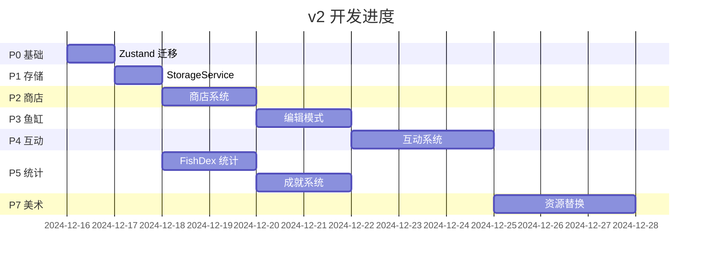

# 📋 v2 实施计划

> 所属: Bottled Ocean v2  
> 状态: 📋 Planning  
> 创建日期: 2024-12-15

---

## 设计目标回顾

参考 [[00-overview#设计目标]]，本次需要达成：

| 目标 | 验收标准 |
|------|---------|
| G1 完整经济循环 | 钓鱼→卖鱼→赚金币→购买装饰→装饰鱼缸 |
| G2 可自定义鱼缸 | 用户可自由摆放/移动/删除装饰物 |
| G3 鱼与装饰互动 | 鱼会主动靠近装饰物并产生互动行为 |
| G4 专注数据可视化 | 查看日/周/月/年的专注统计图表 |
| G5 成就系统 | 解锁成就并查看进度 |
| G6 美术资源化 | 所有鱼和装饰使用图片资源 |

---

# 更新记录
- 2025-12-15: 已阅读 `00-overview.md` 与所有模块设计文档，确认目标、数据流与项目结构。
- 2025-12-15: 下一步按计划开始 P0 Zustand 状态迁移。

## 实施阶段总览



---

## 阶段详情

### P0: Zustand 状态管理

| 属性 | 值 |
|------|---|
| **所属模块** | [[06-user-data]] |
| **预估时间** | 1 天 |
| **依赖** | 无 |

#### 任务清单

- [ ] 安装 Zustand: `npm install zustand`
- [ ] 创建 `store/useGameStore.ts`
  - [ ] 迁移 `coins` 状态
  - [ ] 迁移 `mode` 状态
  - [ ] 迁移 `currentSession` 相关逻辑
- [ ] 创建 `store/useAquariumStore.ts`
  - [ ] 迁移 `aquariumFish` 状态
  - [ ] 新增 `decorations` 状态
  - [ ] 新增 `inventory` 状态
  - [ ] 新增编辑模式状态
- [ ] 创建 `store/useUserStore.ts`
  - [ ] 新增 `sessions` 历史
  - [ ] 新增 `stats` 统计
- [ ] 更新 `App.tsx`
  - [ ] 移除本地 useState
  - [ ] 改用 Zustand hooks
- [ ] 验证：应用正常运行，功能无回归

#### 验收标准

```
✅ 所有页面功能与重构前一致
✅ 金币、鱼缸数据持久化正常
✅ 控制台无报错
```

---

### P1: 存储服务

| 属性 | 值 |
|------|---|
| **所属模块** | [[06-user-data]] |
| **预估时间** | 0.5 天 |
| **依赖** | P0 |

#### 任务清单

- [ ] 创建 `services/StorageService.ts`
  - [ ] 定义 `StorageSchema` 类型
  - [ ] 实现 `save()` / `load()` 方法
  - [ ] 实现 `migrate()` v1→v2 迁移
  - [ ] 实现 `export()` / `import()` 可选
- [ ] 在 Zustand store 中使用 `persist` 中间件
- [ ] 添加启动时迁移检查
- [ ] 测试：清除 localStorage 后首次运行
- [ ] 测试：有 v1 数据时的迁移

#### 验收标准

```
✅ 新用户启动正常
✅ v1 老用户数据迁移成功
✅ 数据刷新后保持
```

---

### P2: 商店系统

| 属性 | 值 |
|------|---|
| **所属模块** | [[04-shop]] |
| **预估时间** | 1.5 天 |
| **依赖** | P0, P1 |

#### 任务清单

- [ ] 创建 `data/decorRegistry.ts`
  - [ ] 定义 3-5 个装饰物（暂用占位图）
  - [ ] 按类别分组
- [ ] 创建 `components/ui/Shop/ShopPanel.tsx`
  - [ ] 分类 Tab 栏
  - [ ] 商品网格
  - [ ] 商品卡片（图片、名称、价格、状态）
  - [ ] 购买按钮
- [ ] 实现购买逻辑
  - [ ] 检查余额
  - [ ] 扣钱
  - [ ] 添加到仓库
- [ ] 在 `App.tsx` 添加商店入口
- [ ] 样式美化

#### 验收标准

```
✅ 能打开商店界面
✅ 能按分类筛选商品
✅ 购买后余额正确扣除
✅ 已购买商品显示"已拥有"
```

---

### P3: 鱼缸编辑模式

| 属性 | 值 |
|------|---|
| **所属模块** | [[02-aquarium]] |
| **预估时间** | 2 天 |
| **依赖** | P2 |

#### 任务清单

- [ ] 更新 `AquariumCanvas.tsx`
  - [ ] 读取 `useAquariumStore` 的 `decorations`
  - [ ] 渲染装饰物
  - [ ] 实现装饰物的 Y 排序
- [ ] 实现编辑模式
  - [ ] 添加"编辑"按钮切换模式
  - [ ] 点击装饰物选中
  - [ ] 选中后显示操作按钮（翻转、删除）
  - [ ] 拖拽移动装饰物
- [ ] 创建仓库面板
  - [ ] 显示已购买未摆放的装饰
  - [ ] 点击从仓库拖出摆放
- [ ] 完成按钮退出编辑模式

#### 验收标准

```
✅ 能进入编辑模式
✅ 能从仓库摆放装饰到鱼缸
✅ 能拖拽移动装饰
✅ 能翻转/删除装饰
✅ 退出编辑模式后装饰保持
```

---

### P4: 互动系统

| 属性 | 值 |
|------|---|
| **所属模块** | [[03-decoration]] + [[01-fish]] |
| **预估时间** | 3 天 |
| **依赖** | P3 |

#### 任务清单

- [ ] 更新装饰物数据结构
  - [ ] 添加 `anchors` 字段
  - [ ] 为现有装饰定义锚点
- [ ] 更新鱼的数据结构
  - [ ] 添加 `state` 字段
  - [ ] 添加 `currentAnchorId` 字段
- [ ] 创建 `systems/InteractionSystem.ts`
  - [ ] 实现锚点占用管理
  - [ ] 实现鱼靠近锚点检测
  - [ ] 实现互动开始/结束逻辑
- [ ] 更新 `systems/FishBehavior.ts`
  - [ ] 状态机切换
  - [ ] 不同状态的移动逻辑
  - [ ] 互动中的特殊动画（可选）
- [ ] 更新 `AquariumCanvas.tsx`
  - [ ] 在游戏循环中调用 InteractionSystem
  - [ ] 可选：为不同状态渲染不同动画

#### 验收标准

```
✅ 鱼会随机靠近装饰物锚点
✅ 鱼到达锚点后状态变化（如 resting）
✅ 停留一段时间后鱼离开继续游泳
✅ 锚点容量限制生效（不会挤太多鱼）
```

---

### P5: FishDex - 专注统计

| 属性 | 值 |
|------|---|
| **所属模块** | [[05-fishdex]] |
| **预估时间** | 2 天 |
| **依赖** | P1 |

#### 任务清单

- [ ] 更新专注完成逻辑
  - [ ] 创建 `FocusSession` 记录
  - [ ] 保存到 `sessions` 历史
  - [ ] 更新 `stats` 统计
- [ ] 创建 `hooks/useFocusStats.ts`
  - [ ] 按时间范围过滤
  - [ ] 生成图表数据
  - [ ] 计算洞察（最佳时段、趋势）
- [ ] 创建 `components/ui/FishDex/BarChart.tsx`
  - [ ] 简单的 CSS 柱状图
  - [ ] 显示标签和值
- [ ] 创建 `components/ui/FishDex/StatsTab.tsx`
  - [ ] 时间范围切换
  - [ ] 渲染柱状图
  - [ ] 显示今日总计和连续天数
  - [ ] 显示专注洞察
- [ ] 更新现有 FishDex 入口，添加 Tab 切换

#### 验收标准

```
✅ 完成专注后记录保存
✅ 能切换日/周/月/年视图
✅ 图表正确显示数据
✅ 连续天数正确计算
```

---

### P6: FishDex - 图鉴与成就

| 属性 | 值 |
|------|---|
| **所属模块** | [[05-fishdex]] |
| **预估时间** | 2 天 |
| **依赖** | P5 |

#### 任务清单

- [ ] 创建 `data/achievements.ts`
  - [ ] 定义 10+ 个成就
  - [ ] 包含不同类型条件
- [ ] 创建 `systems/AchievementSystem.ts`
  - [ ] 实现进度计算
  - [ ] 实现解锁检查
- [ ] 创建 `components/ui/FishDex/CollectionTab.tsx`
  - [ ] 收集进度条
  - [ ] 鱼类图鉴网格
  - [ ] 未解锁显示 ??? 占位
- [ ] 添加成就列表 UI
  - [ ] 已解锁/未解锁样式
  - [ ] 进度显示
- [ ] 在钓鱼完成时检查成就
  - [ ] 新解锁时显示提示

#### 验收标准

```
✅ 图鉴显示所有鱼类
✅ 未钓到的鱼显示为未知
✅ 成就列表正确显示
✅ 满足条件时成就解锁
✅ 解锁时有提示动画
```

---

### P7: 美术资源替换

| 属性 | 值 |
|------|---|
| **所属模块** | [[01-fish]] + [[03-decoration]] |
| **预估时间** | 视资源而定 |
| **依赖** | P4（可并行）|

#### 任务清单

- [ ] 准备美术资源
  - [ ] 鱼精灵表（至少 5 种）
  - [ ] 装饰物图片（至少 8 种）
  - [ ] 分层装饰物（至少 2 种）
- [ ] 创建 `assets/sprites/` 目录
  - [ ] `fish/` 子目录
  - [ ] `decor/` 子目录
- [ ] 更新 `fishRegistry.ts`
  - [ ] 替换 SVG 为图片路径
  - [ ] 添加 `frameCount` 等动画参数
- [ ] 更新 `decorRegistry.ts`
  - [ ] 替换 SVG 为图片路径
  - [ ] 添加分层 URL（如有）
- [ ] 更新渲染代码
  - [ ] 支持精灵表帧动画
  - [ ] 支持分层装饰物渲染
- [ ] 删除或弃用旧的 SVG 生成代码

#### 验收标准

```
✅ 所有鱼使用图片资源
✅ 精灵表动画播放正常
✅ 分层装饰物渲染正确（鱼可被遮挡）
✅ 性能无明显下降
```

---

## 实施顺序总结

```
1. P0: Zustand 迁移        → 基础设施
2. P1: StorageService      → 基础设施
3. P2: 商店系统            → 经济循环 (G1)
4. P3: 编辑模式            → 自定义鱼缸 (G2)
5. P4: 互动系统            → 鱼与装饰互动 (G3)
6. P5: 专注统计            → 数据可视化 (G4)
7. P6: 图鉴与成就          → 成就系统 (G5)
8. P7: 美术资源            → 资源化 (G6)
```

---

## 完成后验收

对照 [[00-overview#设计目标]]：

| 目标 | 达成 | 备注 |
|------|------|------|
| G1 完整经济循环 | ⬜ | P0+P1+P2 完成后验收 |
| G2 可自定义鱼缸 | ⬜ | P3 完成后验收 |
| G3 鱼与装饰互动 | ⬜ | P4 完成后验收 |
| G4 专注数据可视化 | ⬜ | P5 完成后验收 |
| G5 成就系统 | ⬜ | P6 完成后验收 |
| G6 美术资源化 | ⬜ | P7 完成后验收 |

---

## 相关文档

- [[00-overview]] - 设计总览
- [[01-fish]] - 鱼模块
- [[02-aquarium]] - 鱼缸模块
- [[03-decoration]] - 装饰物模块
- [[04-shop]] - 商店模块
- [[05-fishdex]] - FishDex 模块
- [[06-user-data]] - 用户数据模块

---

#v2 #implementation #plan

